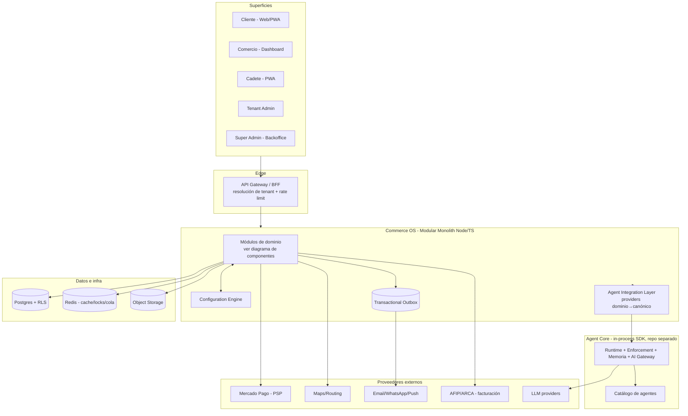
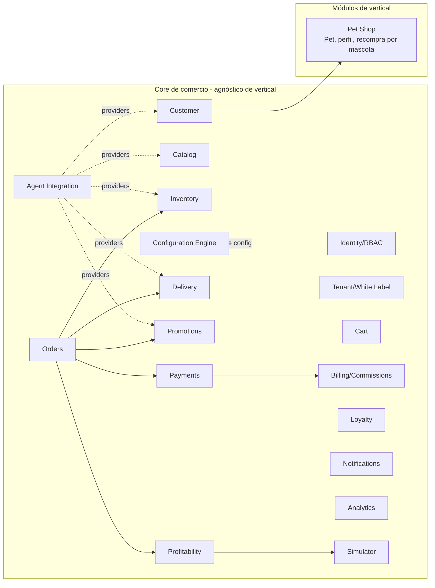

# D + E — Arquitectura y stack recomendados

## Respuesta directa al punto 11 del brief: ¿Modular Monolith o Microservicios?

**Modular Monolith. Sin dudas, para el arranque.** El documento lo recomienda y es
correcto. La justificación honesta:

| Criterio | Modular Monolith | Microservicios |
|----------|------------------|----------------|
| Velocidad de desarrollo V1 | **Alta** (un deploy, un repo, refactor fácil entre módulos) | Baja (contratos de red, versionado, orquestación desde el día 1) |
| Consistencia transaccional (pedido↔pago↔stock) | **Trivial** (una DB, transacciones ACID) | Difícil (sagas, eventual consistency, compensaciones) |
| Costo operativo | **Bajo** (un servicio) | Alto (N servicios, service mesh, observabilidad distribuida) |
| Aislamiento de fallas | Menor | Mayor |
| Escalar un módulo caliente por separado | No (se escala todo) | Sí |
| Riesgo de "big ball of mud" | **Sí, si no se enforced** ([A1]) | Menor (fronteras físicas) |

Con el volumen de un pet shop (y hasta bastante después), **ninguna** ventaja de
microservicios se paga sola. La consistencia transaccional entre pedido, pago y stock
—que en monolith es una transacción de base de datos y en microservicios es una saga
distribuida— es exactamente lo que no querés complicar en un commerce que maneja plata.

**La condición para que esta decisión no se pague después** es enforcement de límites
([A1]): módulos que son dueños de sus tablas, un dependency-linter que falla el build si
un módulo mete mano en otro, y comunicación cross-módulo por eventos (outbox). Eso es lo
que permite, cuando *de verdad* haga falta, **extraer un módulo a servicio** (ej.:
Delivery cuando la logística escale, o Payments) sin cirugía. Se llama "monolith
listo para estrangular" (strangler-ready).

**Cuándo reconsiderar (señales concretas, no antes):** un módulo con un perfil de carga
radicalmente distinto (ej. el tracking de delivery en tiempo real con miles de eventos/s),
o equipos independientes que se pisan en el deploy, o un requisito de aislamiento físico
por un tenant enterprise. Ahí se extrae *ese* módulo, no se reescribe todo.

---

## Vista de arquitectura (contexto)

> El **Agent Integration Layer** es el punto donde Commerce OS implementa los
> *providers* de agent-core (catálogo→`CatalogProvider`, inventario→`InventoryProvider`,
> cliente→`ContactsProvider`, delivery→`LogisticsProvider`, etc.). agent-core corre
> **en el mismo proceso** (D2) leyendo solo esos providers; nunca toca la DB del
> dominio.

---

## Diagrama de componentes (módulos del monolith)

Reglas de módulo ([A1]): cada caja es dueña de sus tablas; las flechas sólidas son
llamadas a la **interfaz pública** del módulo destino (no a su DB); las relaciones
reactivas (ej. "pago confirmado → generar factura", "pedido entregado → notificar")
van por **eventos** vía outbox, no por llamada directa.

---

## E — Stack recomendado (con justificación, no por popularidad)

| Capa | Elección | Por qué |
|------|----------|---------|
| **Lenguaje/Runtime** | **Node.js 20+ / TypeScript** | Integración in-process con agent-core (D2), que es TS. Un solo lenguaje en todo el sistema. Tipado fuerte para contratos de dinero y config. |
| **Framework backend** | **NestJS** (o Fastify + estructura de módulos) | NestJS da módulos con fronteras explícitas e inyección de dependencias — encaja natural con el modular monolith y su enforcement. Si se prefiere algo más liviano, Fastify + convención de módulos. |
| **Base de datos** | **PostgreSQL** | RLS (D4) para aislamiento multi-tenant, transacciones ACID (clave para pedido↔pago↔stock), JSONB para config/metadata, robustez probada. No hay alternativa mejor para esto. |
| **ORM/driver** | **Prisma** o **Drizzle** | Deben soportar `SET LOCAL app.tenant_id` para RLS. Drizzle es más liviano y explícito con SQL; Prisma tiene mejor DX. Decisión secundaria; ambos sirven. |
| **Cache / locks / cola V1** | **Redis** | Cache de config resuelta y recomendaciones del agente, locks de reserva de stock (G1), y cola simple para el worker del outbox en V1. |
| **Colas/eventos** | **Outbox en Postgres + worker** (V1) → **broker** (V2 si el volumen lo pide: Redis Streams / SQS / RabbitMQ) | [A2]: no meter un broker distribuido en V1. Contratos de evento definidos desde ahora. |
| **Object storage** | **S3-compatible** (AWS S3 / Cloudflare R2 / MinIO) | Fotos de producto, evidencia de entrega del cadete, assets de branding por tenant. |
| **Auth** | **JWT/OIDC** propio o Auth provider (ej. Clerk/Auth0/Supabase Auth) + **MFA para admins** | RBAC propio en el módulo Identity (permisos finos por tenant/merchant). MFA obligatorio para roles admin (sección 15). Evaluar build-vs-buy en Fase 1. |
| **Pagos** | **Payment Orchestrator propio** con `PaymentProvider`; **Mercado Pago** primera impl. | Sección 10 y [05-pagos-y-economia.md]. La abstracción evita lock-in de PSP. |
| **Facturación** | Módulo Billing + `InvoiceIssuer`; impl. **AFIP/ARCA** (validación fiscal profesional) | [D3$]. |
| **Maps/Routing** | Abstracción `GeoProvider`; impl. inicial **Google Maps** o **Mapbox** (geocoding + distancia/ETA) | Delivery necesita geocoding, distancia y ETA. Abstraído para no atarse; ruteo agrupado (V4) puede requerir un motor de VRP dedicado más adelante. |
| **Notificaciones** | Abstracción `NotificationProvider`; **WhatsApp** (Cloud API), email (Resend/SES), push web | agent-core ya modela un agente `whatsapp`. Multi-canal por eventos. |
| **Observabilidad** | **OpenTelemetry** (traces + métricas) + logs estructurados + **métricas por tenant** + dashboards de conciliación de dinero | Sección 15. Agrego: métricas por-tenant (para billing/análisis) y tablero de conciliación (dinero). |
| **CI/CD** | GitHub Actions (ya hay workflows en agent-core) | Lint + typecheck + tests (incluidos los de aislamiento y pagos) como gate de merge. |
| **Hosting** | Contenedor (Docker) en **Fly.io / Railway / Render** V1 → **AWS/GCP** cuando escale | V1 no necesita Kubernetes. Un contenedor + Postgres gestionado + Redis gestionado alcanza. |
| **IaC** | Terraform (cuando se pase a cloud grande) | No en V1; V1 puede ser config declarativa del PaaS. |

**Lo que NO recomiendo para V1** (sobre-ingeniería): Kafka, Kubernetes, microservicios,
un data warehouse dedicado, un feature-flag SaaS externo (el Config Engine propio lo
cubre), GraphQL federado. Cada uno agrega operación sin pagar su costo a esta escala.

---

## Integración con Agent Core (respuesta al punto 4 del brief)

**Mecanismo (D2): in-process, vía `contracts` + providers.** No API/webhooks en V1.

Qué aporta cada opción que el brief menciona, y cuál aplica:

| Opción del brief | Rol en esta arquitectura |
|------------------|--------------------------|
| **SDK** | **Sí, V1.** Commerce OS importa `@agent-core/contracts` y `@agent-core/core`, implementa providers e invoca el runtime. |
| **Tools** | **Sí.** Las acciones del agente son *tools* de agent-core; las de escritura pasan por el enforcement. Commerce OS registra sus tools de dominio (buscar_producto, armar_carrito, etc.). |
| **Permisos / scopes** | **Sí, reusando el enforcement de agent-core** (autonomía manual/assisted/autonomous + intercepción de tools de escritura + entidades protegidas + presupuesto). No se reconstruye. |
| **Memoria** | **Sí.** agent-core tiene memoria; el agente del cliente la usa scopeada a tenant+cliente. |
| **Eventos / Webhooks** | **Diferido (V2+).** Solo cuando agent-core sea servicio remoto o producto para terceros. |
| **API remota** | **Diferido (V2+).** Cuando Agent Core se venda/deploye aparte. |

**Separación de responsabilidades** (coincide con la sección 6 del doc y con lo que
agent-core ya es):

- **Commerce OS** = datos y operaciones (catálogo, stock, pedidos, clientes, delivery,
  promos, config). Es una *app* desde la óptica de agent-core: aporta adapters, tools,
  auth, resolución de tenant, schema y UI.
- **Agent Core** = runtime, memoria, tools, model routing, permisos, workflows,
  auditoría. Agnóstico de dominio. **No se toca en esta fase.**
- Los **agentes de desarrollo/DevOps pertenecen a Agent Core**, no a Commerce OS
  (coincide con el brief).

Detalle del Customer Shopping Agent y su modelo de scopes en
[06-agentes-ia.md](06-agentes-ia.md).
