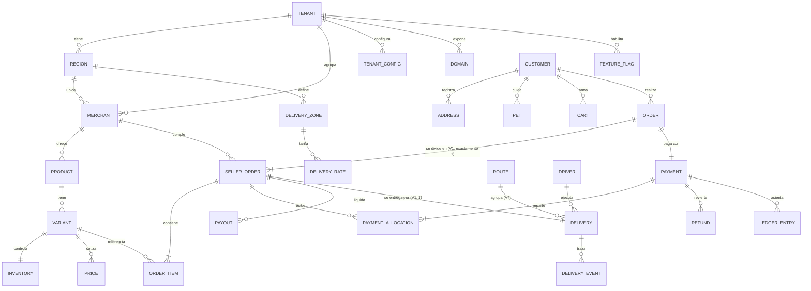
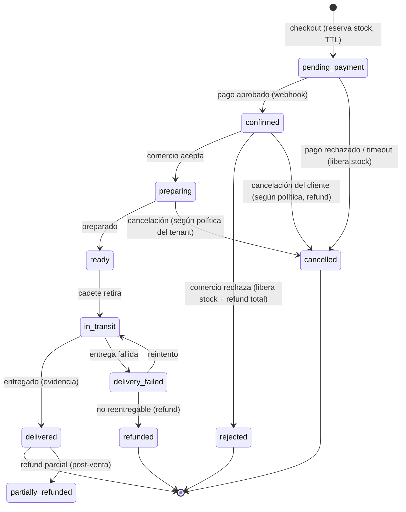
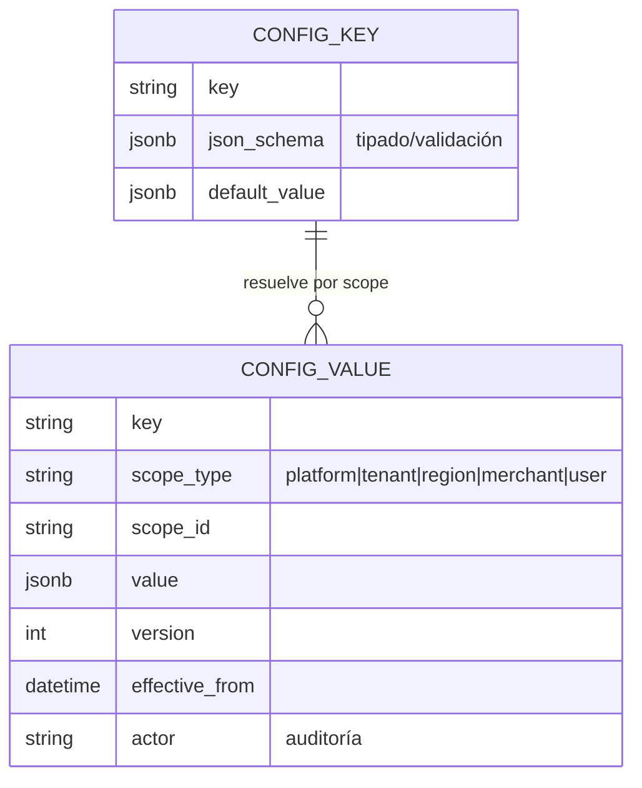
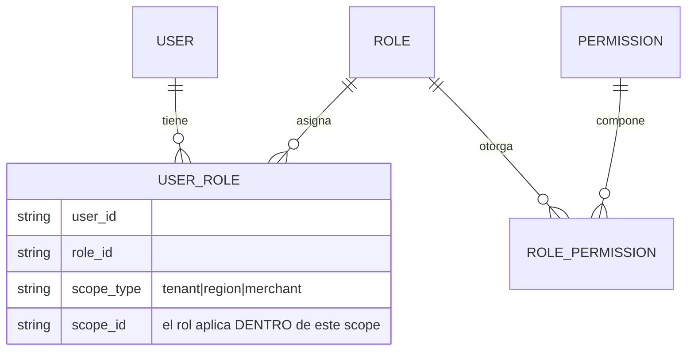
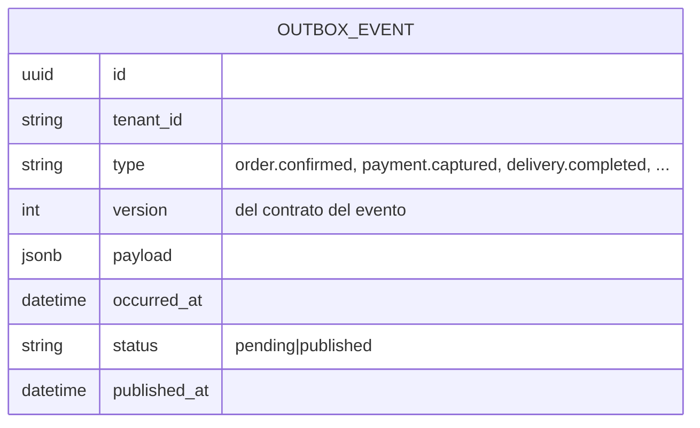

# F — Modelo de datos

Principios: (1) toda tabla tiene `tenant_id` y está bajo RLS ([S1]/D4); (2) todo monto
es `bigint` en unidad mínima + `currency` (D7); (3) el modelo soporta multi-seller y
consolidación **desde el inicio**, con V1 restringido por config, no por esquema ([E1]).

## ERD núcleo (comercio + pedidos + pagos + delivery)



### Las 4 invariantes que evitan reconstruir (respuesta al punto 5 del brief)

Este es el corazón de "agregar multi-seller sin rehacer Order". El brief pide que este
modelo evolucione de:

```
Cliente → Comercio → Cadete → Cliente            (V1)
```
a:
```
Cliente → [Comercio A, B, C] → Consolidación → Ruta → Cliente   (V4)
```
sin tocar `Order`, `Delivery` ni `Payment`. Se logra con:

1. **`ORDER_ITEM` cuelga de `SELLER_ORDER`, nunca de `ORDER`.** Un pedido es una lista
   de sub-pedidos por comercio. V1: `Order` tiene exactamente 1 `SellerOrder`. V4:
   tiene N. El código de items no cambia — ya opera sobre `SellerOrder`.
2. **`DELIVERY` cuelga de `SELLER_ORDER`, y `ROUTE` agrupa `DELIVERY`.** V1: 1
   `SellerOrder` → 1 `Delivery`, sin `Route`. V4: consolidación = crear un `Route` que
   agrupa varias `Delivery` de varios `SellerOrder` con múltiples pickups. `Delivery`
   y `Order` no se tocan.
3. **`PAYMENT` a nivel `Order`; `PAYMENT_ALLOCATION` reparte a cada `SellerOrder` +
   plataforma + delivery + PSP.** V1: 1 allocation (al comercio propio). V2/V4: N
   allocations. El checkout del cliente es **uno** (sección 10: "checkout simple, pero
   separación interna"). El ledger de doble partida (abajo) hace que refunds parciales
   preserven las demás partidas (criterio de aceptación #9).
4. **"1 pedido = 1 comercio = 1 entrega" es CONFIG, no código.**
   `orders.maxSellersPerOrder = 1` (default V1). El carrito valida contra ese flag.
   Cambiar a multi-seller = subir el flag + activar el módulo de consolidación.
   **Prohibido** un `if tenant == ... / if ciudad == ...` (regla del brief).

### Notas de columnas clave

- `MONEY` en todas partes = `{ amount_minor bigint, currency char(3) }`.
- `PRICE` es versionado y con `effective_from/to` (precios cambian; el pedido congela el
  precio aplicado en `ORDER_ITEM.unit_price_snapshot`, pero "repetir compra" re-cotiza —
  [U2]).
- `SELLER_ORDER.status` = máquina de estados (abajo).
- `PAYMENT_ALLOCation.target_type` ∈ {`merchant`, `platform_commission`, `delivery`,
  `psp_fee`, `promo_subsidy`} → así el mismo modelo cubre V1 (una) y marketplace (varias).
- `LEDGER_ENTRY` = doble partida: cada movimiento de dinero genera asientos
  debe/haber por cuenta (cliente, comercio, plataforma, PSP, cadete). Es la fuente de
  verdad para conciliación; `PAYMENT`/`REFUND`/`PAYOUT` son proyecciones.

---

## Máquina de estados del pedido (gap [G2] resuelto)



Reglas:
- Cada transición tiene un **actor autorizado** (cliente / comercio / cadete / sistema)
  validado por RBAC.
- Toda transición a estado terminal negativo (`rejected`, `cancelled`, `delivery_failed
  →refunded`) dispara **compensación**: liberar reserva de stock + refund por el ledger.
- La **política de cancelación** (hasta qué estado el cliente puede cancelar con refund
  total) es **config por tenant** (Config Engine), no hardcode.
- Reserva de stock ([G1]): en `checkout` se reserva atómicamente
  (`UPDATE inventory SET reserved = reserved + n WHERE available - reserved >= n`), con
  TTL; `confirmed` la consume, `cancelled/timeout` la libera. Redis puede acelerar el
  lock pero la verdad está en Postgres.

---

## Modelo de configuración (resumen; detalle en 07-configuracion.md)



Resolución: se busca el valor en el scope **más específico** que aplique
(user → merchant → region → tenant → platform), gana ese. Versionado + `effective_from`
+ `actor` = auditoría de cambios sensibles (comisiones, precios). Feature flags = un
`CONFIG_KEY` de tipo boolean con targeting por scope.

---

## Modelo de permisos (RBAC — respuesta al "modelo de permisos" del brief)



- **RBAC scopeado:** un rol se otorga *dentro de un scope* (ej. "Owner del Merchant X",
  "Admin del Tenant Y"). Un usuario puede tener roles en varios scopes.
- **Permisos = verbo + recurso** (ej. `orders:read`, `orders:transition`,
  `config:write`, `payout:approve`). Los agentes tienen su propio scope de tools
  (agent-core), separado del RBAC humano.
- **MFA obligatorio** para roles con permisos admin/dinero (sección 15).
- Roles base V1: `super_admin` (plataforma), `tenant_admin`, `merchant_owner`,
  `merchant_staff`, `driver`, `customer`. Todos derivables/extensibles por config.

---

## Modelo de eventos (outbox — respuesta al "modelo de eventos" del brief)



- El evento se escribe en la **misma transacción** que el cambio de estado (evita el
  dual-write pedido↔pago↔notificación). Un worker publica los `pending` async.
- **Contratos de evento versionados** desde V1, aunque el transporte V1 sea la tabla +
  worker. En V2 se cambia el transporte a un broker sin tocar productores/consumidores.
- Consumidores V1: Notifications (mail/WhatsApp/push), Analytics, Profitability,
  Agent Integration (alimenta memoria/recomendaciones del agente).
- Eventos núcleo: `order.created/confirmed/cancelled/rejected`,
  `payment.captured/refunded`, `delivery.assigned/picked_up/completed/failed`,
  `stock.reserved/released`, `config.changed`, `merchant.onboarded`.

---

## Módulo de vertical: Pet Shop ([A3]/D10)

Fuera del core agnóstico. Tablas propias: `PET` (especie, raza, peso, notas de
salud — PII sensible, ver [S4]), `PET_PRODUCT_HISTORY`, `REPURCHASE_ESTIMATE`
(cadencia de consumo por mascota). El core no sabe qué es una mascota; el módulo Pet se
"engancha" al `CUSTOMER` y alimenta al agente. Una ferretería sería otro módulo, sin
tocar el core.
