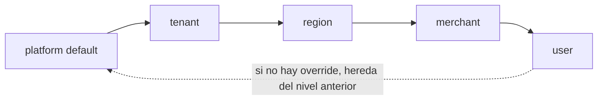
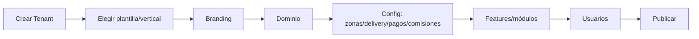

# Configuration Engine

Responde al punto 12 del brief y al principio "configuration first". Es **el** componente
que hace realidad "desarrollar una vez el core y no tocar código por cliente/ciudad/
comercio". También responde al "modelo de configuración" del punto 10.

## Qué resuelve y qué NO ([C1] + [C2])

- **Resuelve:** comisiones, precios, promociones, delivery, zonas, horarios, branding,
  dominios, módulos, permisos, reglas, planes, límites, funcionalidades, textos,
  notificaciones — todo lo que el brief lista como "decisión comercial".
- **NO es:** un mini-lenguaje / DSL Turing-completo ([C2]). Config **tipada** +
  **primitivas de regla declarativas acotadas**. Si algo no entra, es señal de que
  necesita código + una decisión, no un lenguaje nuevo.

## Jerarquía de resolución (herencia + precedencia)

Cinco niveles (D1). Gana el **más específico** que tenga un valor para la clave:

```
platform  →  tenant  →  region  →  merchant  →  user
(default)                                        (override más específico)
```



Ejemplo: `commission.rate` puede tener default de plataforma 10%, override de tenant 8%,
y override de un merchant estrella 6%. Un pedido de ese merchant resuelve 6%; otro
merchant del mismo tenant, 8%.

## Anatomía de una clave de config

```typescript
type ConfigKey = {
  key: string;                 // "commission.rate", "delivery.freeThreshold", "branding.primaryColor"
  jsonSchema: JsonSchema;      // TIPADO y validación (mismo patrón que agent-core)
  defaultValue: unknown;       // default de plataforma
  category: 'money' | 'branding' | 'ops' | 'features' | 'text' | 'rules';
  sensitive: boolean;          // money/rules → requieren auditoría + effective-dating
};

type ConfigValue = {
  key: string;
  scopeType: 'platform'|'tenant'|'region'|'merchant'|'user';
  scopeId: string;
  value: unknown;              // validado contra jsonSchema al escribir
  version: number;             // versionado
  effectiveFrom: string;       // effective-dating (para cambios de comisión/precio)
  actor: string;               // AUDITORÍA: quién lo cambió
  reason?: string;
};
```

### Por qué tipado + versionado + effective-dating no es opcional

- **Tipado (JSON Schema):** una config sin validar rompe en runtime. Escribir un valor
  inválido debe fallar al guardar, no en el checkout de un cliente. agent-core ya usa
  este patrón (`JsonSchema` en manifests) — se reutiliza el enfoque.
- **Versionado + auditoría (`actor`, `reason`):** cambiar una comisión o un precio es una
  **acción de dinero**. Tiene que quedar registrado quién, cuándo y por qué (criterio de
  seguridad, sección 15: "audit logs para acciones sensibles").
- **Effective-dating:** un cambio de comisión no puede afectar pedidos ya en curso. El
  valor tiene fecha de vigencia; el pedido congela la config que aplicó.

## Feature flags

Un feature flag es un `ConfigKey` de tipo boolean con targeting por scope. Ejemplos que
el criterio de aceptación pide poder togglear sin código:
`features.multiSellerCart` (default false), `features.loyalty`, `features.customerAgent`,
`orders.maxSellersPerOrder` (número, no boolean, pero misma mecánica).

Así el criterio de aceptación *"activar/desactivar módulos con feature flags"* y
*"la estructura multi-seller puede agregarse sin rehacer Order"* se cumplen cambiando
config, no código.

## Reglas declarativas acotadas (no DSL)

Para precios/promos/delivery/comisiones se usan **primitivas de condición sobre
atributos conocidos**, evaluadas por el motor. Ejemplo de una regla de delivery:

```json
{
  "rule": "delivery.rate",
  "when": [
    { "attr": "zone", "op": "in", "value": ["centro", "norte"] },
    { "attr": "orderTotal", "op": ">=", "value": 1500000 }
  ],
  "then": { "deliveryCharge": 0, "subsidySource": "platform" }
}
```

Atributos permitidos (cerrados, no arbitrarios): `zone`, `distance`, `hour`, `weekday`,
`category`, `orderTotal`, `customerSegment`, `merchant`. El motor evalúa; no ejecuta
código del tenant. Esto cubre los casos del brief (comisiones, precios, promociones,
delivery, zonas, horarios, límites) **sin** un lenguaje.

> Regla de oro (del brief): si un requisito exige `if tenant == "Gualeguay"`, se
> **detiene** y se convierte en config (una regla/valor con scope), o se justifica como
> código genuinamente genérico. Prohibido lo específico por cliente en el código.

## Cache e invalidación

La config resuelta se cachea (Redis) por `(key, scope)` con invalidación al escribir
(evento `config.changed` por outbox). Lectura caliente sin pegarle a Postgres en cada
request.

## Cómo esto habilita el flujo White Label (punto 8 del brief)



Cada paso **escribe config con scope=tenant** (o crea entidades: Domain, UserRole).
"Publicar" es flippear un flag de estado. **Ningún paso toca código.** La "plantilla
Pet Shop" es un **conjunto de valores de config por defecto + módulos habilitados +
schema del vertical** que se copian al crear el tenant. Así el criterio de aceptación
*"crear un segundo tenant sin tocar código"* y *"cambiar branding y dominio por
configuración"* se cumplen por construcción.

## Documento vivo

Este diseño se materializa en `docs/CONFIGURATION.md` (que el doc manda mantener,
sección 16), con el catálogo completo de claves de config a medida que se implementan.
