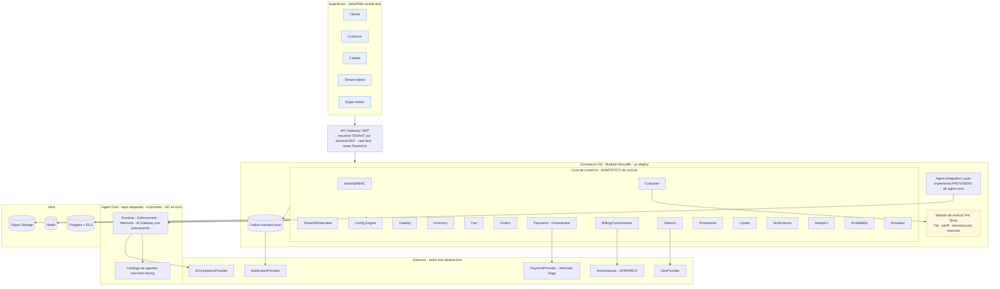
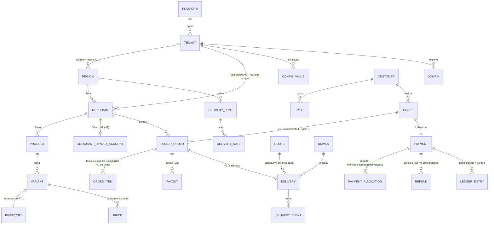
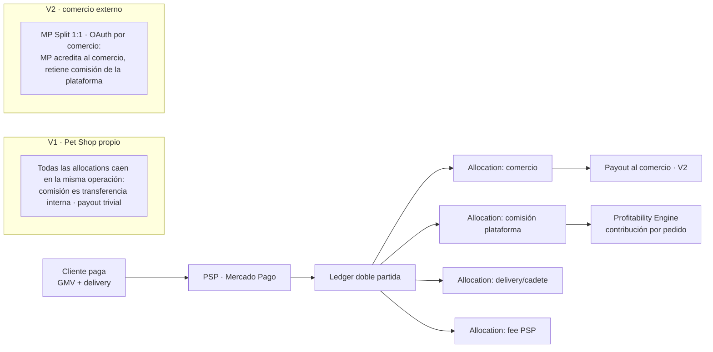
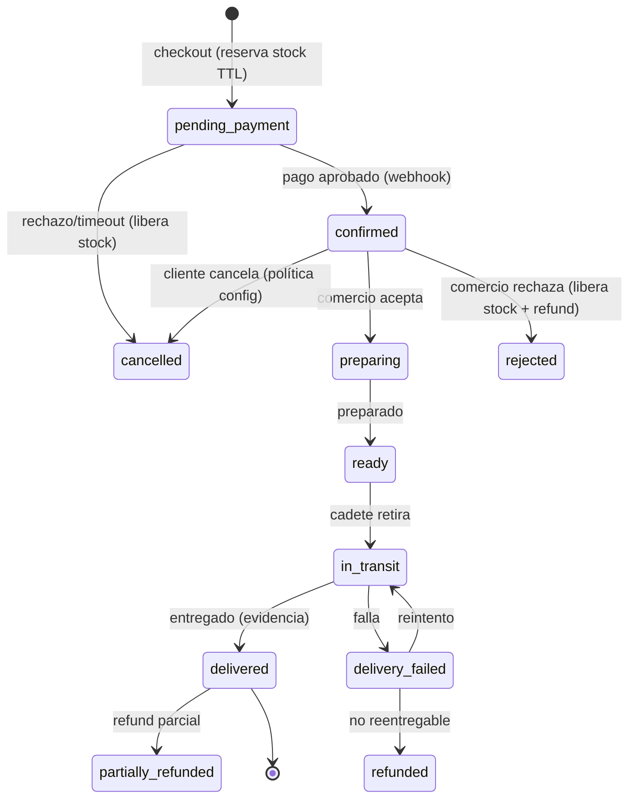
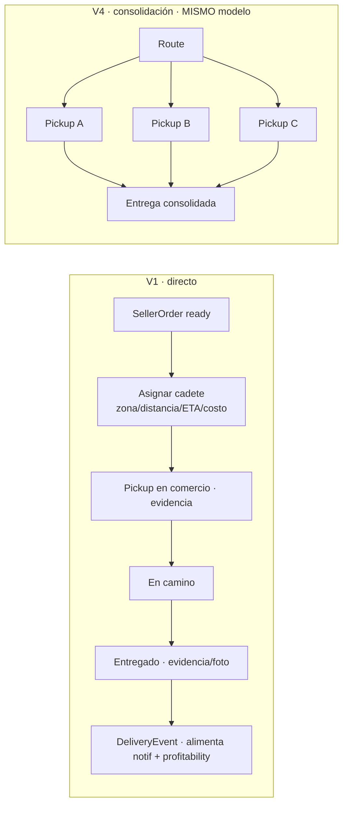
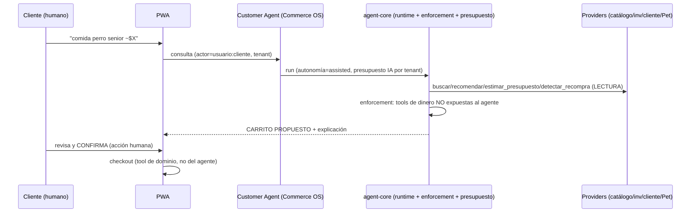
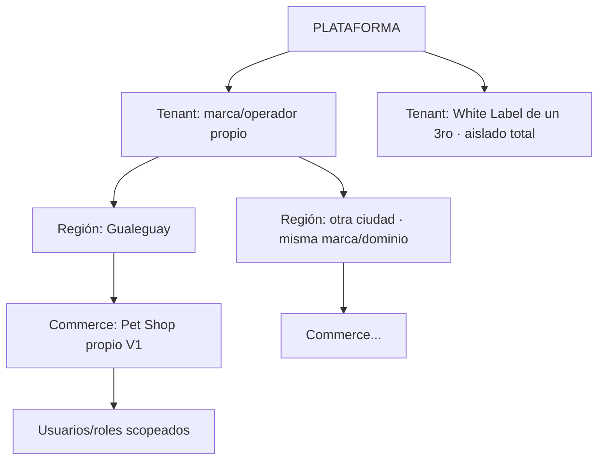
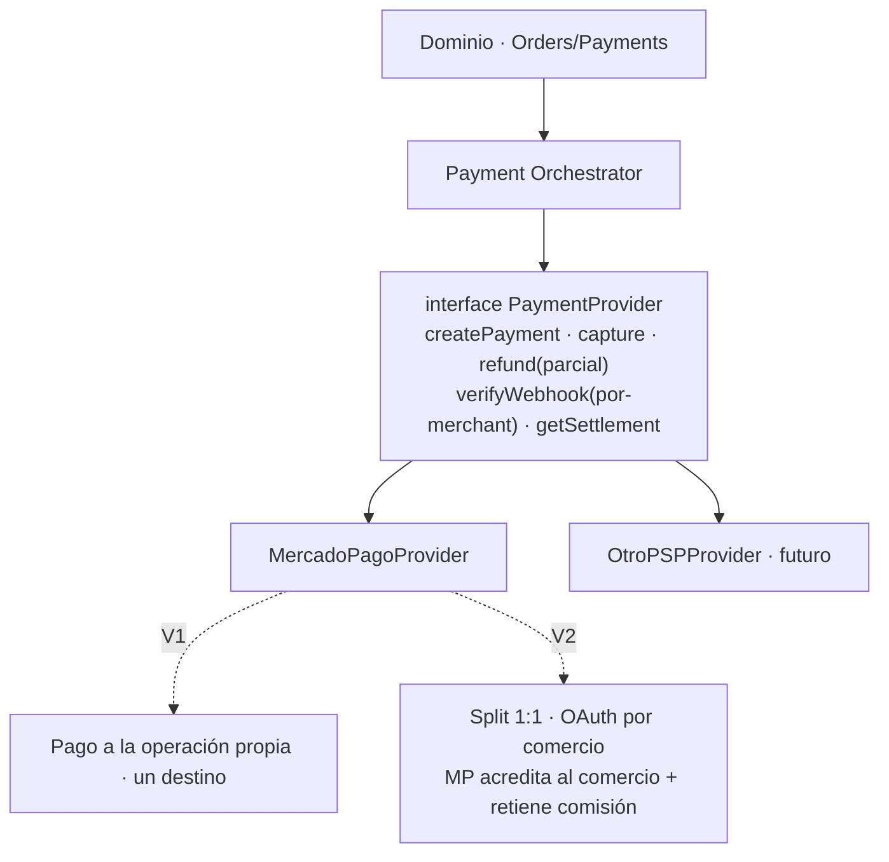
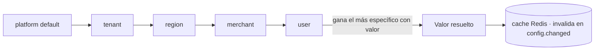

# Cierre de Fase 0 — Los 10 entregables previos a implementar

Documento de revisión final antes de la Fase 1. Consolida las decisiones ya cerradas
(tras tus respuestas L1–L9) y presenta los **10 entregables** que pediste, autocontenido.
El detalle de cada tema vive en los docs `01`–`10`; acá está la versión final para
revisar de una.

> **Regla que gobierna todo esto:** desarrollar el core una vez; toda decisión comercial
> es **config**, nunca código. Prohibido `if tenant == "Gualeguay"`.
>
> **Lo que NO decide el software y queda marcado para validación profesional (contador/
> abogado AR):** quién es el vendedor de registro y quién factura en V1, IVA/IIBB, y si
> el esquema MP Split 1:1 (V2) evita que la plataforma quede como agregador de pagos.

---

## 1. Arquitectura final recomendada

**Modular Monolith en Node/TypeScript, con fronteras enforced, y Agent Core desacoplado
in-process.** (Comparación completa Monolith vs Microservicios en
[03-arquitectura.md](03-arquitectura.md); confirmado en L8: no microservicios por moda.)

**Por qué esta y no otra:**
- **Un solo lenguaje (TS)** en Commerce OS + Agent Core → integración in-process sin
  serialización ni servicio aparte (D2/L9). Agent Core sigue **separado** (Commerce OS
  solo depende de `@agent-core/contracts` e inyecta providers); mañana puede exponerse
  como servicio sin reescribir agentes.
- **Fronteras enforced** (cada módulo dueño de sus tablas + dependency-linter + eventos
  vía outbox) → se puede extraer un módulo a servicio cuando *de verdad* escale, sin
  reescribir. Es lo que hace segura la apuesta al monolito ([A1]).
- **Sin Kafka/k8s/microservicios en V1**: no se pagan solos a esta escala.

**Separación Commerce OS ↔ Agent Core (confirmada L9):**
Commerce OS **expone** tools/APIs/eventos; Agent Core los **consume**. Los agentes de
desarrollo/DevOps/mantenimiento viven en Agent Core, **fuera** del core comercial.

---

## 2. ERD (modelo de datos)

Invariantes que garantizan evolución a multi-seller **sin rehacer Order/Delivery/Payment**
(confirmado L5). Detalle y notas de columnas en [04-modelo-de-datos.md](04-modelo-de-datos.md).

Las 4 invariantes clave: (1) `OrderItem`→`SellerOrder`; (2) `Delivery`→`SellerOrder`,
`Route` agrupa; (3) `Payment` a nivel Order, `PaymentAllocation` reparte; (4) "1 pedido =
1 comercio" es `orders.maxSellersPerOrder=1` (**config**, no código).

---

## 3. Flujo de dinero

Dinero en **enteros/centavos + moneda** (D7). **Ledger de doble partida = fuente de
verdad**; Payment/Refund/Payout son proyecciones. En V1 la plata va a la operación propia
(un destino); el modelo ya soporta el reparto marketplace de V2 sin cambios de esquema.

**Idempotencia en 2 niveles** ([D2$]): `Idempotency-Key` en checkout **y** dedupe de
webhooks por `provider_event_id`. **Conciliación**: job que compara settlement del PSP vs
ledger y alerta discrepancias. Detalle en [05-pagos-y-economia.md](05-pagos-y-economia.md).

---

## 4. Flujo de pedidos

Máquina de estados explícita con caminos de falla y compensaciones ([G2]). Reserva de
stock atómica con TTL evita oversell ([G1]).

Cada transición: actor autorizado (RBAC) + evento al outbox. Política de cancelación =
**config por tenant**.

---

## 5. Flujo de delivery

V1: directo comercio→cliente, sin recorrer varios comercios (confirmado L5). El modelo ya
soporta consolidación V4 (`Route` agrupa `Delivery`) sin tocar nada.

Costeo: `DeliveryRate` por zona/distancia/horario/modalidad (config). **No se regala
delivery sin fuente de financiación**: el gap (costo cadete − precio al cliente) tiene
`subsidySource` explícito (plataforma/comercio/promo). Ver los números en §Profitability.

---

## 6. Flujo del Customer Agent

Parte importante de V1 (L6): busca, recomienda, usa historial, trabaja con mascotas,
repite compras, trabaja con presupuesto, detecta recompra, prepara carrito. **Toda acción
de pago requiere confirmación explícita del humano** (L6) — forzado por el enforcement de
agent-core, no por prompt ([S2]).

Tools del agente: `buscar_producto`, `recomendar`, `comparar`, `detectar_recompra`,
`estimar_presupuesto`, `armar_carrito` (prepara). **Sin** `checkout/pay/place_order`.
Memoria scopeada tenant+cliente (PII, borrable). Detalle en
[06-agentes-ia.md](06-agentes-ia.md).

---

## 7. Modelo Multi-Tenant

Multi-tenant desde el inicio (L7). Jerarquía de 5 niveles; **ciudad = región** dentro del
tenant; **White Label de un tercero = tenant nuevo** (D1). L1: el Pet Shop propio es un
**Commerce/Tenant** modelado como independiente aunque legalmente sea la misma sociedad.

**Aislamiento forzado por construcción (D4):** Postgres **RLS** + `TenantCtx` obligatorio
(falla cerrado, igual que agent-core). El código puede olvidar el `WHERE`; la base niega
filas ajenas. Tests de aislamiento por entidad como gate de CI. La config y el branding
se **heredan** por la jerarquía (ver §9). Flujo White Label (crear tenant → plantilla →
vertical → branding → dominio → catálogo → delivery → pagos → comisiones → features →
publicar) = **solo escribe config**, cero código (L7).

---

## 8. Payment Orchestrator

Abstracción `PaymentProvider` para **no atar el dominio a Mercado Pago** (L2/L3). MP es la
primera implementación. El reparto multi-seller vive en `PaymentAllocation` + ledger,
**no** en un split plano del PSP.

- **V1:** Pet Shop propio, pago a la operación, sin marketplace.
- **V2:** comercios externos vía **OAuth**, **MP Split Payments 1:1** a evaluar; el
  comercio recibe su parte, la plataforma su comisión.
- Secretos/credenciales **por-merchant**, cifrados (KMS) — nunca en config plana ([S3]).
- Refund parcial afecta 1 allocation; el ledger preserva las demás (criterio #9).
- **[Validación fiscal]** que el esquema Split evite el rol de agregador: marcado.

Detalle en [05-pagos-y-economia.md](05-pagos-y-economia.md).

---

## 9. Configuration Engine

El corazón de "configurar en vez de codear". Config **tipada (JSON Schema) + versionada +
auditada + con effective-dating**, resuelta por herencia; feature flags como subtipo;
reglas **declarativas acotadas** (sin DSL — [C2]).

- Resolución: gana el scope **más específico** con valor (ej. `commission.rate`: 7%
  plataforma → 6% para un merchant estrella).
- **Versionado + `actor` + `reason` + `effective_from`**: cambiar comisión/precio es
  acción de dinero → auditada, y no afecta pedidos en curso.
- Feature flags: `features.customerAgent`, `orders.maxSellersPerOrder`,
  `features.multiSellerCart`, etc. → toggles sin código (criterio de aceptación).
- Reglas: condiciones sobre atributos cerrados (`zone`, `distance`, `hour`, `category`,
  `orderTotal`, `customerSegment`, `merchant`), no scripting.

Detalle en [07-configuracion.md](07-configuracion.md).

---

## 10. Roadmap técnico V1

Fases; cada una termina con **tests + docs** (respeta la sección 16 del v3). Orden por
prioridad: seguridad/multi-tenancy y dinero primero.

| Fase | Entregable | Cierra con |
|------|-----------|-----------|
| **F1 Fundaciones** | Monorepo TS, módulos + dependency-linter, Postgres **+ RLS + TenantCtx**, Config Engine, Identity/RBAC + MFA admin, Outbox | Tests de **aislamiento por entidad** + resolución de config |
| **F2 Catálogo** | Catalog, Inventory (**reserva con TTL**), Cart, módulo **Pet** | Test no-oversell + E2E carrito |
| **F3 Pedidos+Dinero** | Orders (máquina de estados), **Payment Orchestrator + MP**, ledger, idempotencia | Test **webhook no duplica** + **refund parcial** + máquina de estados |
| **F4 Delivery+Economía** | Delivery directo (zona/distancia/ETA/costo/evidencia), **Profitability**, **Simulador** | Test costeo + cálculo de contribución (dos P&L) |
| **F5 Agente** | Integración Agent Core (providers) + **Customer Agent propose-only** | Test **agente sin tool de dinero** + presupuesto IA |
| **F6 White Label** | Provisioning por config (crear tenant→publicar), branding/dominio, backoffice | Test **crear 2º tenant sin código** + branding por config |
| **F7 Endurecimiento** | Suite completa aislamiento/pagos, conciliación, observabilidad, **restore probado** | CI gate: invariantes de tenancy y dinero bloquean merge |

Roadmap de producto V1–V6 y riesgos en [10-roadmap-riesgos.md](10-roadmap-riesgos.md).

---

## Profitability Engine — escenarios 5% / 7% / 10% (respuesta a L4)

**Corrida real** del motor (no una fórmula abstracta). Todos los valores son **parámetros
de config**, no constantes. Supuestos base editables: GMV $30.000, margen comercio 30%,
**PSP 5,5% lo paga el comercio** (default realista en MP Split; alternativa configurable),
cadete $2.500/entrega, IA $100/pedido. La contribución de plataforma usa la **fórmula
corregida** ([D-ERR]): comisión + margen logístico − IA (el GMV **no** es sumando).

### Matriz principal (GMV $30.000)

| Comisión | Delivery (cliente) | Subsidio del gap | **Contrib. PLATAFORMA/pedido** | **Neto COMERCIO/pedido** |
|:---:|:---:|:---:|:---:|:---:|
| 5% | $2.500 (full) | — | **$1.400** | $5.850 |
| 5% | $1.500 | plataforma $1.000 | **$400** | $5.850 |
| 5% | $1.500 | comercio $1.000 | **$1.400** | $4.850 |
| 5% | $0 (gratis) | plataforma $2.500 | **−$1.100** ❌ | $5.850 |
| **7%** | $2.500 (full) | — | **$2.000** | $5.250 |
| **7%** | **$1.500** | **plataforma $1.000** | **$1.000** ✅ | **$5.250** |
| 7% | $1.500 | comercio $1.000 | $2.000 | $4.250 |
| 7% | $0 (gratis) | plataforma $2.500 | −$500 ❌ | $5.250 |
| 10% | $2.500 (full) | — | $2.900 | $4.350 |
| 10% | $1.500 | plataforma $1.000 | $1.900 | $4.350 |
| 10% | $0 (gratis) | plataforma $2.500 | $400 | $4.350 |

### Sensibilidad al ticket (comisión 7%, cliente paga $1.500)

| GMV | Contrib. plataforma | Neto comercio | Delivery % s/GMV |
|:---:|:---:|:---:|:---:|
| $15.000 | −$50 ❌ | $2.625 | 10,0% |
| $30.000 | $1.000 ✅ | $5.250 | 5,0% |
| $50.000 | $2.400 ✅ | $8.750 | 3,0% |
| $80.000 | $4.500 ✅ | $14.000 | 1,9% |

### Delivery gratis condicionado al ticket (comisión 7%, plataforma subsidia)

| GMV | Contrib. plataforma |
|:---:|:---:|
| $30.000 | −$500 ❌ |
| $50.000 | $900 ✅ |
| $80.000 | $3.000 ✅ |

### Break-even (pedidos/mes para cubrir costo fijo de plataforma)

| Costo fijo/mes | 7% full pass ($2.000/ped) | 7% subs. parcial ($1.000/ped) | 10% subs. parcial ($1.900/ped) |
|:---:|:---:|:---:|:---:|
| $300.000 | 150 | 300 | 158 |
| $500.000 | 250 | 500 | 263 |
| $800.000 | 400 | 800 | 421 |

### Qué determina el motor (los 4 objetivos de L4)

1. **El PSP es el mayor apalancamiento**, no la comisión. Que el comercio absorba el fee
   de MP (default realista en Split) libera la comisión para ser contribución limpia.
2. **El delivery gratis a secas es insostenible** salvo con ticket alto o comisión ≥10%.
   La forma sana: **gratis por umbral de ticket** (ej. free sobre $50.000) — se paga solo.
3. **Estructura recomendada de arranque (parametrizable):** **comisión 7% + el cliente
   paga ~$1.500 de delivery (plataforma subsidia $1.000) + gratis sobre umbral de
   ~$50.000**. Con eso, en el ticket base los 4 objetivos se cumplen:
   - Comercio gana: **$5.250/pedido** (30% de margen menos comisión y PSP). ✅
   - Cliente paga delivery razonable: **$1.500** (~5% del ticket), gratis en compras
     grandes. ✅
   - Cadete cobra bien: **$2.500/entrega** (parámetro, se ajusta por zona/distancia). ✅
   - Plataforma con contribución positiva: **$1.000/pedido**; break-even ~300–500
     pedidos/mes según costo fijo. ✅
4. **El ticket bajo (<$15.000) es el punto débil**: ahí el delivery se come el margen.
   Palancas de config: mínimo de compra, delivery pleno bajo cierto ticket, o incentivar
   canasta más grande vía el agente (recompra/packs) — sin tocar código.

> Todo esto son **valores de simulación**, no los definitivos. Se cargan como config y el
> Simulador comercial deja al comercio mover los supuestos. Los % finales se fijan cuando
> quieras, sin recompilar nada.

---

## Qué necesito de vos para pasar a Fase 1

Casi nada bloquea. Solo confirmá:

1. **¿Validás la estructura económica de arranque** (7% / delivery $1.500 con subsidio
   parcial / gratis sobre umbral) como valores iniciales de config? (No son definitivos.)
2. **¿Avanzamos con el stack propuesto** (Node/TS, NestJS o Fastify, Postgres+RLS,
   Prisma/Drizzle, Redis)? Si tenés preferencia en el framework o el ORM, decímelo.
3. Confirmame que **la validación fiscal (contador/abogado AR)** corre en paralelo y no
   frena la Fase 1 (el software no asume postura fiscal; queda todo configurable).

Con eso, arranca la **Fase 1** por la **F1 (Fundaciones)**: monorepo + multi-tenancy con
RLS + Config Engine, que es el cimiento de todo lo demás.
